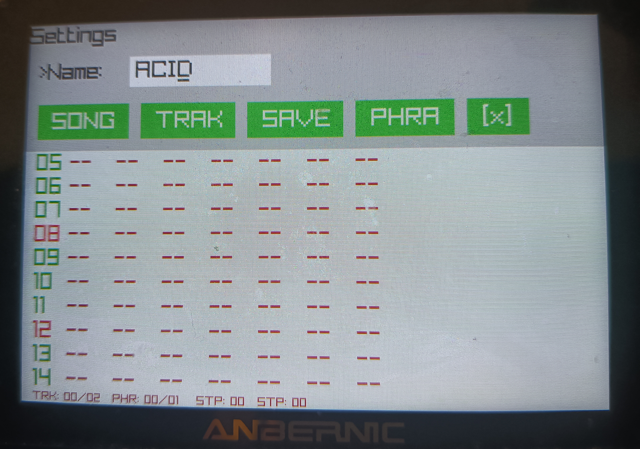

# trkr

`trkr` is a lightweight, low-overhead music tracker built in Go using the raylib library. Designed with the constraints and aesthetics of classic handheld consoles like the Game Boy in mind, `trkr` provides a streamlined, grid-based interface for sequencing phrases and tracks using minimal controls.

## Features

- Retro-Optimized Design: Tailored to run efficiently and intuitively on Game Boy-like devices or handheld emulators.
- Minimalist Control Scheme: Eschews complex PC keyboard layouts in favor of a clean, button-combination workflow.
- Native Performance: Written in Go with raylib for lightweight graphics and low-latency audio rendering.

---

## Getting Started

### Prerequisites

To build `trkr` from source, ensure you have Go installed on your system along with the necessary development libraries for your graphics and audio drivers (required by raylib).

On Debian/Ubuntu systems:

sudo apt update
sudo apt install libasound2-dev libx11-dev libxrandr-dev libxi-dev libxcursor-dev libxinerama-dev # (for default, X11 Linux amd64 build)

### Building

Clone the repository and build or run the project:

git clone https://github.com/kompadre/trkr.git

### Available Targets

* `make linux-wayland` (Default)
  Builds the native AMD64 binary with native Wayland support. Output: `trkr`.

* `make linux-amd64`
  Builds the AMD64 binary configured for X11 environments. Output: `trkr-x11`.

* `make linux-arm64`
  Cross-compiles the binary for ARM64 Linux devices (such as handhelds). This automatically builds a dedicated Docker container environment to handle the CGO toolchain and SDL/OpenGL ES2 dependencies without polluting your local system. Output: `trkr-arm64`.

* `make win64`
  Cross-compiles a 64-bit Windows executable. This requires the `x86_64-w64-mingw32-gcc` toolchain to be present on your host machine for CGO compilation. Output: `trkr.exe`.

* `make clean`
  Removes all compiled binaries and temporary build-tracking files.

---

## User Manual & Navigation

Because `trkr` is optimized for handheld form factors, navigation and editing rely on simple combinations of directional arrows and action buttons (A, B, and R).

### 1. Navigation & Views
The tracker structure is split into overarching Tracks and individual Phrases.

* Switch Views: Hold R + `Left / Right / Up / Down Arrow` to navigate between Tracks and Phrases.
* Grid Navigation: Use the standalone `Arrow Keys` to move your cursor through rows and columns within the active view.

### 2. Editing & Sequencing
Notes and values are manipulated directly using action button modifiers rather than a traditional piano keyboard layout.

* Change Note: Hold A + `Up / Down / Left / Right Arrow` to cycle through and change the current note value under the cursor.
* Add Phrase: Press A + B + `Down Arrow` to append a new phrase.
* Clone Phrase: Press A + B + R + `Down Arrow`. It will append a copy of current phrase at the end.
* Remove Phrase: Press A + B + `Up Arrow` to delete the last phrase.

---

## License

This project is licensed under the MIT License - see LICENCE.txt for details.
